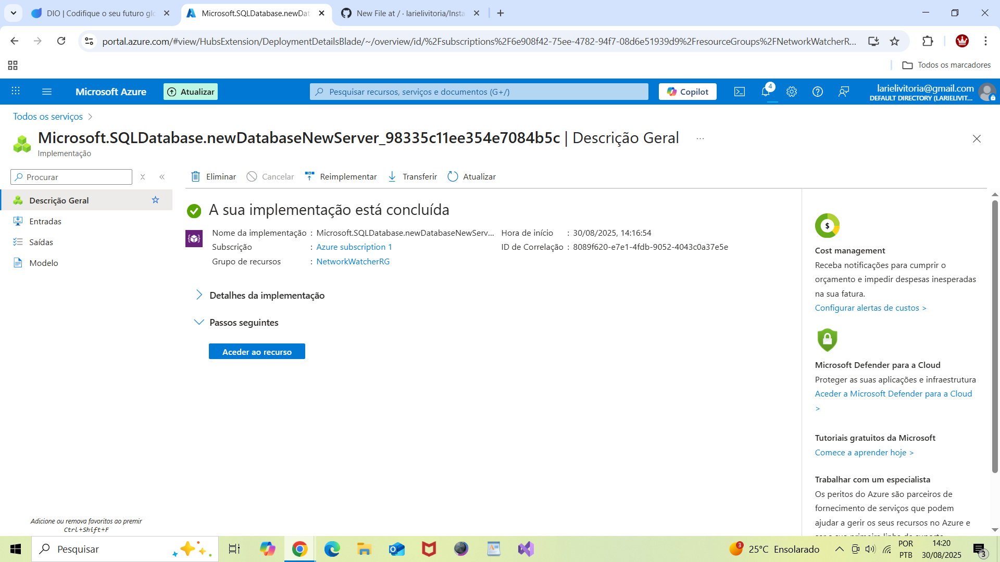

# InstanciaBancoDeDados

Este repositório documenta a experiência prática de configuração de uma instância de Banco de Dados na plataforma Microsoft Azure.

Criação da instância de banco de dados
- Escolha do tipo de banco: SQL Database 
- Configurações iniciais:
  - Nome da instância: `azureDB`
  - Grupo de recursos: `NetworkWatcherRG`
  - Região: `Brazil South`
  - Nível de desempenho: `Série standard (5.ª Geração)`
- Captura de tela:
  

Tive dificuldades para criar a instância e entender como ela funciona

Não consegui realizar a conexão ao banco pelo SQL Management Studio

